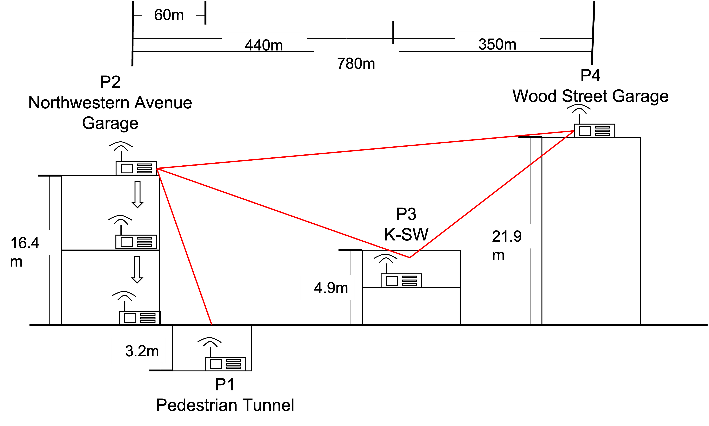

# Performance Evaluation of Off-grid Mesh Network Communication using goTenna Pro X and Meshtastic


<!--- 
   
-->

<h2>Team Member :smiley:</h2> 

### Gwangyeok Kim 🐝
- **Chonnam National University**
- Major in computer engineering
- Did some arduino project
- Handling C, C++, Java, linux
- **AI**, Natural language, computer vision, machine learning
- Interested in **semiconductor**

### Keonwoo Lim 🧸
- **Kyeonggi University**
- Major in computer engineering
- **Web development - Java(spring) Backend**
- A bit of frontend
- Android Java App development

### Sujee Noh 🐣
- **Chonnam National University**
- Major in software engineering
- Web development Backend using Django
- **IoT forensics research for one year**
- In software system and language lab (smart contract and blockchain technology)
- Handling Python, Javascript, linux, C++

### Younguk Maeng 🦦
- **Soongsil University**
- Major in software engineering
- Web development Backend using Spring
- **Intern as a backend developer for half a year**
- Handling Java, Spring, Python, Linux


<h2> Folder Structure </h2>

```
GO duck

├── README.md
├── code
│   ├── Visualisation
│   │   ├── 3rd_floor_broadcast.png
│   │   ├── 3rd_floor_private.png
│   │   ├── error_rate.png
│   │   ├── farm_map1.PNG
│   │   ├── farm_map2.PNG
│   │   ├── ground_broadcast.png
│   │   ├── ground_private.png
│   │   ├── moclk_map.PNG
│   │   ├── real_map.PNG
│   │   ├── rooftop_broad.png
│   │   ├── rooftop_private.png
│   │   └── total.png
│   ├── error_rate.py
│   ├── imgs
│   │   ├── Farm_Environment.png
│   │   ├── Farm_environment2.jpeg
│   │   ├── Meshtastic.png
│   │   ├── MeshtasticTopology.png
│   │   ├── Result_Campus.png
│   │   ├── Result_Farm.png
│   │   ├── goTennaTopology.png
│   │   ├── goTenna_Frequency.png
│   │   ├── goTenna_QRcode.png
│   │   ├── n_second_campus.jpg
│   │   └── sub_map.PNG
│   └── rssi.py
├── paper
│   ├── KSW 2023 Winter Mid Paper GO duck.pdf
│   └── KSW 2023 Winter Final Paper GO duck.pdf
├── presentation
│   ├── KSW 2023 Winter Final Presentation GO duck.pptx
│   ├── KSW 2023 Winter Mid Presentation GO duck.pptx
│   └── demo.mp4
└── weeklyreport
    ├── KSW 2023 Winter 01122023 GO duck.pdf
    ├── KSW 2023 Winter 01202023 GO duck.pdf
    ├── KSW 2023 Winter 01272023 GO duck.pdf
    ├── KSW 2023 Winter 02032023 GO duck.pdf
    ├── KSW 2023 Winter 02102023 GO duck.pdf
    ├── KSW 2023 Winter 02172023 GO duck.pdf
    └── KSW 2023 Winter 02242023 GO duck.pdf
```

<h2> Research Problem Statement </h2>

Off-grid mesh communications can help in rescue operations when natural disasters like hurricanes destroy the infrastructure beyond repair. A mesh network configuration using wireless modulation techniques specialized for long-distance transmission but with a trade-off in data rate is the de facto approach. This research compares two mobile radio systems that use such modulation schemes: goTenna and Meshtastic. Both systems function as external antennas and offer a GUI and complementary applications that require Bluetooth connectivity, allowing text-based communications with GPS location transmission. However, goTenna devices are a commercial solution operating on a proprietary protocol and frequency bands, while Meshtastic is a community-driven open source project using license-free LoRa frequency, resulting in a significant disparity in price and accessibility. Conducting an analysis of these two mobile mesh networking systems in various scenarios and environments generates informative feedback for rescue teams who require mobile communication that traditional radio or network technologies cannot provide.

<h2> Research Novelty </h2>

The purpose of this research is to conduct an in-depth comparison between two mobile radio systems, goTenna Pro X and Meshtastic. Both systems behave as an external antenna and come with user-friendly interfaces and complementary applications that require Bluetooth connectivity, enabling text-based communications with GPS location transmission. However, there is a steep disparity in price and accessibility as goTenna devices are a commercial solution that operates on proprietary protocol and frequency bands, whilst Meshtastic is a community-driven open-source project that relies on license-free LoRa frequency. 
Anlayzing these two mobile mesh networking systems in various scenarios and environments is important as it generates informative feedback to rescue teams in need of mobile communication that is not possible via traditional radio or network technologies Therefore, conducting an in-depth performance evaluation of these systems is important as it provides useful feedback to rescue teams who rely on communication that is not possible via traditional radio or networking technologies. 

<h2> Overview or diagram visual </h2>
<p align="center">
   

</p>

<p>The networking protocol for goTenna Pro X is called Aspen Grove. Meshtastic networking protocol is based on Radiohead Library.</p>


<h2> Envrionment Settings </h2>

* goTenna Pro X   

Android: https://play.google.com/store/apps/details?id=com.gotenna.proag&hl=en_US&gl=US   
iOS: https://apps.apple.com/us/app/gotenna/id994940286

https://support.gotennapro.com/hc/en-us/articles/360028755151-Frequency-Sets

<p align="center">
&ensp;&ensp;&ensp;&ensp;&ensp;&ensp;
</p>
    
goTenna devices were provided with UHF antennas, we picked up an arbitrary starting point in the given range. It was recommended by the official guide from goTenna to set power output and bandwidth to the maximum value for the optimal performance, and the channel spacing for 11.8 kHz bandwidth to 0.025 MHz. 
   
   
   
* Meshtastic   

ESP board: LILYGO® TTGO T-Beam V1.1 ESP32 (http://www.lilygo.cn/claprod_view.aspx?TypeId=62&Id=1281&FId=t28:62:28)


Android: https://play.google.com/store/apps/details?id=com.geeksville.mesh   
iOS: https://apps.apple.com/us/app/gotenna/id994940286    


https://meshtastic.org/docs/getting-started   
https://flasher.meshtastic.org/   

T-Beam -> v2.20 alpha (now beta) -> install

<p align="center">

</p>

The modem settings and number of hops were set on default.

<h2> Methodology </h2>

We have tested goTenna and Meshtastic in two different environment settings, on a university campus and on a farm. The two different locations highlight the contrast between urban and rural environments. The human populations, buildings, and infrastructure are greater in urban areas. On the other hand, farms are less interfered with radio waves because of fewer structures.

### On campus 🏫

 

Additional relay node, P2, was placed in the same parking lot as P1 to verify messages could be sent in the tunnel to other nodes (P3, P4). The fixed endpoints (P1, P4) were in the tunnel and on the roof. Endpoints were connected by the relay node P3, which was positioned inside the building. The new relay node P2 moved from the roof to inside and outside the parking lot.

### On farm 🌲

 

<p>The objective of this experiment was to establish the furthest distance at which point-to-point communication could be reliably maintained. The experiment was conducted on a farm which is located approximately 30 minutes away from the campus by car. The farmland is a wide obstruction-free field, with a clear line of sight.</p>

<h2> Result </h2>

### Result on campus


In urban area, goTenna showed more reliable message delivery with higher RSSI values, while Meshtastic had lower receiver sensitivity.

### Result on farm


In rural areas, both devices were able to maintain connectivity at distances greater than 9 km. This demonstrates that with the proper placement of relay nodes, the mesh network can be effectively scaled over long distances.


# KSW_2023_WINTER
